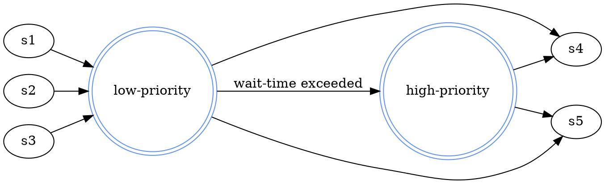
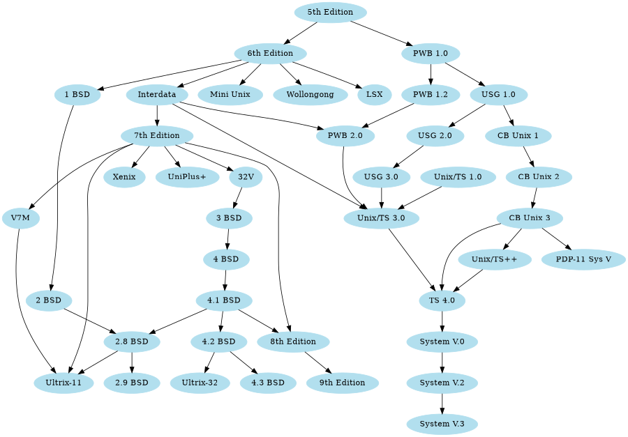

---
title: Dot / Graphviz Plugin
...

# DOT / Graphviz

You can integrate dot diagrams as follows.  The syntax spec for dot graphs can be found at 
[graphviz.org](http://www.graphviz.org).
 
The following example code:

<pre><code>&#96;&#96;&#96;dot("Sample Flowchart"){width:600px}
digraph { 

  rankdir=LR;

  "low-priority" [shape="doublecircle" color="cornflowerblue"];
  "high-priority" [shape="doublecircle" color="cornflowerblue"];

  "s1" -> "low-priority";
  "s2" -> "low-priority";
  "s3" -> "low-priority";

  "low-priority" -> "s4";
  "low-priority" -> "s5";
  "low-priority" -> "high-priority" [label="wait-time exceeded"];

  "high-priority" -> "s4";
  "high-priority" -> "s5";

}
&#96;&#96;&#96;
</code></pre>

Generates this picture:

Below is a large diagram that is too small to see. Using the native zoom/pan features of the SVG you 
can inspect all of the low level details. The source of the graph came from the [graphviz example 
site](https://graphviz.gitlab.io/_pages/Gallery/directed/profile.html).

