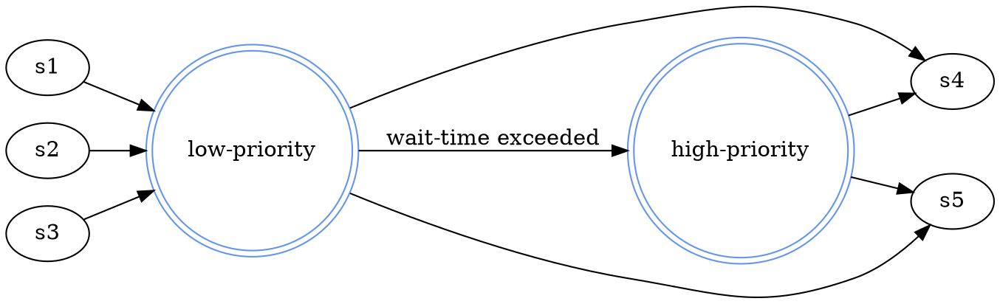

---
title: Dot / Graphviz Plugin
...

# DOT / Graphviz

You can integrate dot diagrams as follows.  It's super easy.  The syntax spec for dot graphs can be
found at [graphviz.org](http://www.graphviz.org).

