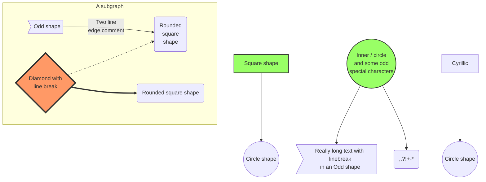
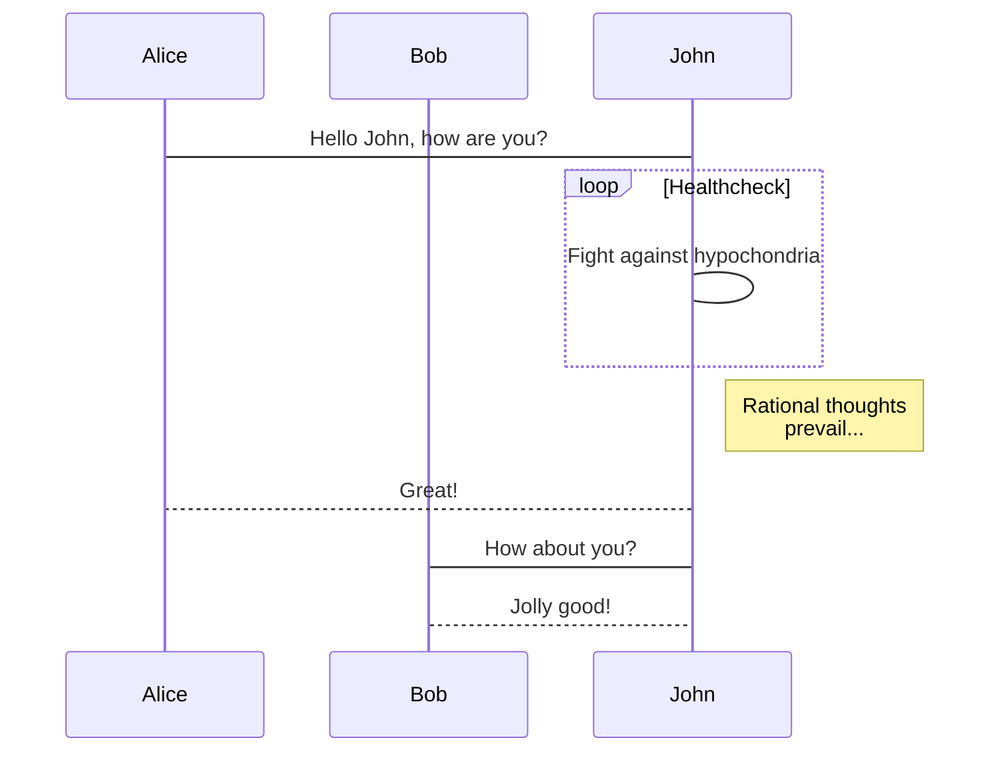
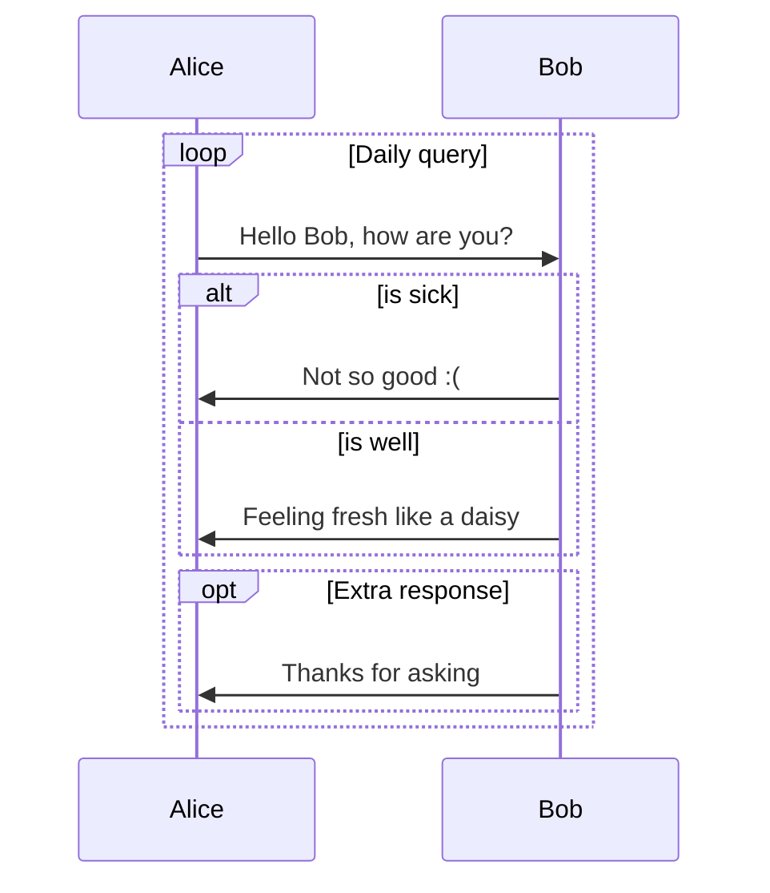
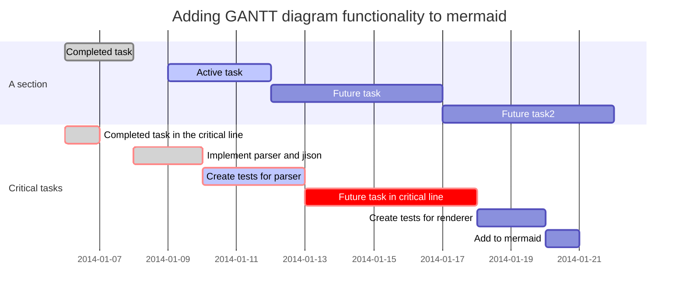

---
title: Mermaid Plugin
...

# Mermaid Plugin

Mermaid is a language designed to simplify diagram integration into documents using a markdown 
inspired (i.e., simple) syntax.  For details on mermaid, see <https://mermaidjs.github.io>.

## Flowcharts

<pre><code>
&#96;&#96;&#96;mermaid("flowchart")
graph TD;
    A-->B;
    A-->C;
    B-->D;
    C-->D;
&#96;&#96;&#96;
</code></pre>

is rendered as:

Another example of a larger flowchart:

## Sequence Diagrams

### Basic

<pre><code>
&#96;&#96;&#96;mermaid("sequence diagram")
sequenceDiagram
    participant Alice
    participant Bob
    Alice->John: Hello John, how are you?
    loop Healthcheck
        John->John: Fight against hypochondria
    end
    Note right of John: Rational thoughts  prevail...
    John-->Alice: Great!
    John->Bob: How about you?
    Bob-->John: Jolly good!
&#96;&#96;&#96;
</code></pre>

is rendered as:

### Message to Self in Loop

## Gantt Diagrams

<pre><code>
&#96;&#96;&#96;mermaid("gantt diagram")
gantt
        dateFormat  YYYY-MM-DD
        title Adding GANTT diagram functionality to mermaid
        section A section
        Completed task            :done,    des1, 2014-01-06,2014-01-08
        Active task               :active,  des2, 2014-01-09, 3d
        Future task               :         des3, after des2, 5d
        Future task2               :         des4, after des3, 5d
        section Critical tasks
        Completed task in the critical line :crit, done, 2014-01-06,24h
        Implement parser and jison          :crit, done, after des1, 2d
        Create tests for parser             :crit, active, 3d
        Future task in critical line        :crit, 5d
        Create tests for renderer           :2d
        Add to mermaid                      :1d
&#96;&#96;&#96;
</code></pre>

is rendered as:

## Tool Notes

The mermaid tool relies on `node.js`. That must be installed separately.
The version of mermaid installed in this repo is manually copied from the [latest 
commit](https://github.com/mermaidjs/mermaid.cli/commit/1f9a6bce11289f4227d3fb0a93a512690953540d) as 
of Nov. 3, 2017. To update the tool version, it mus be manually pulled and placed in the mermaid.cli 
directory.
